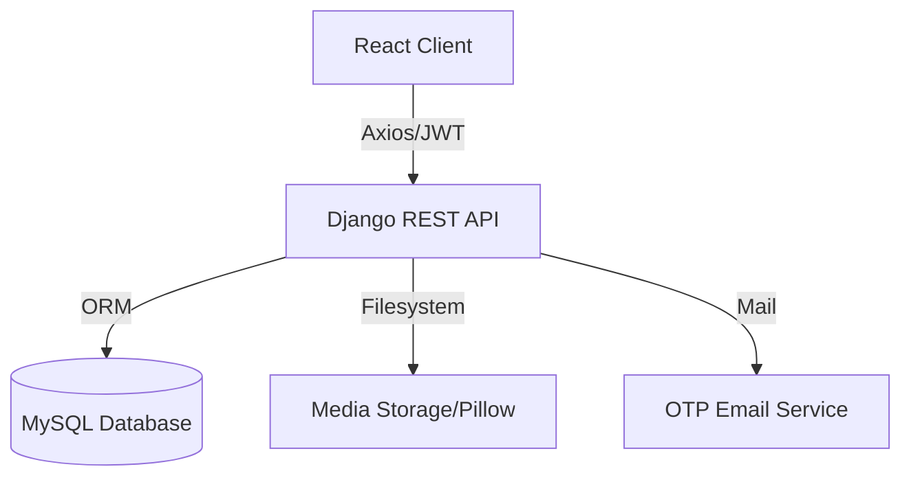

# AirBNB Clone - Professional Hosting Platform 🏨🏆

A high-performance, full-stack AirBNB clone designed with a focus on professional hosting. Featuring a sophisticated subscription engine, a robust prorated billing system, and a premium "Masterpiece" UI.

---

## 📑 Table of Contents
1. [Introduction](#introduction)
2. [Key Features](#key-features)
3. [Technology Stack](#technology-stack)
4. [System Architecture](#system-architecture)
5. [Database Schema](#database-schema)
6. [API Specification](#api-specification)
7. [Engineering Deep Dives](#engineering-deep-dives)
8. [Setup & Installation](#setup--installation)
9. [Conclusion](#conclusion)

---

## 🏗️ Introduction
This project represents a full-scale reproduction of the AirBNB platform, specifically optimized for **Professional Hosting Management**. Unlike basic clones, this system integrates complex financial logic, subscription-based gating, and a host-centric wallet system to simulate a real-world SaaS environment.

---

## 🚀 Key Features

### 🏨 Hosting Experience
- **Multi-tiered Subscriptions**: Choose between Trial, Standard, Premium, and Ultimate plans.
- **Dynamic Listing Limits**: Listing capacity is automatically enforced based on the active subscription tier.
- **Amenity Gating**: Access to premium amenities (Pool, Gym, EV Charging, etc.) is locked based on the host's plan.

### 💰 Billing & Finance (The Core)
- **30-Day Billing Engine**: Automated calculation of subscription cycles and billing dates.
- **Prorated Adjustments**: Real-time math for upgrades and downgrades, ensuring hosts only pay for the time they use.
- **Host Wallet System**: Integrated digital wallet for credit tracking, automated refunds, and balance application.
- **Audit Trails**: Full transaction history (`SubscriptionTransaction`) for transparency.

### 🔍 Discovery & UX
- **Refined Professional Navbar**: A solid-header design with glassmorphism effects and optimized account management.
- **Smart Search**: Destination autocomplete powered by OpenStreetMap API.
- **Host Dashboard**: Live analytics, wallet balance snapshots, and property management tools.

---

## 🛠️ Technology Stack

### Backend (Django Ecosystem)
- **Django 6.0+**: Core Web Framework.
- **DRF**: REST API Engineering.
- **SimpleJWT**: Secure Token-Based Auth.
- **MySQL**: Production-grade Relational Database.
- **Pillow**: Image & Media Processing.

### Frontend (React Ecosystem)
- **React 19**: Component Architecture.
- **Vite**: High-Speed Build Tool.
- **Tailwind CSS 4.x**: Modern Styling Engine with Glassmorphism.
- **Lucide React**: Premium Iconography.
- **Axios**: API Communication.
- **Recharts**: Data Visualization for Host Analytics.

---

## 🏗️ System Architecture
The system follows a decoupled architecture where the React frontend communicates with the Django backend via a stateless JSON API.

---

## 📊 Database Schema

### `User` (Custom AbstractUser)
| Field | Type | Description |
| :--- | :--- | :--- |
| `role` | CharField | `guest` or `host` |
| `subscription_tier` | CharField | Trial, Standard, Premium, Ultimate |
| `wallet_balance` | Decimal | Current credit/refund amount |
| `last_billed_at` | DateTime | Timestamp for 30-day cycle math |

### `Property` (The Asset)
| Field | Type | Description |
| :--- | :--- | :--- |
| `host` | ForeignKey | Owner of the listing |
| `property_type` | Enum | Apartment, Villa, House, Room |
| `amenities` | JSONField | Gated list of features |
| `is_active` | Boolean | Determined by active plan limits |

---

## 📖 API Specification

### Authentication
- `POST /api/register/`: Account creation & OTP generation.
- `POST /api/login/`: JWT generation and session start.
- `POST /api/verify-otp/`: email verification and account activation.

### Hosting & Billing
- `POST /api/subscription/quote/`: Returns proration math for a plan change.
- `POST /api/subscription/`: Executes a plan change and transaction.
- `GET /api/transactions/`: Returns the full financial statement statement.
- `GET /api/properties/my/`: List host-owned properties.

---

## 🧠 Engineering Deep Dives

### The Proration Engine
When a host changes plans, the system performs a high-precision calculation:
1. **Calculate Remaining Days**: `30 - (current_date - last_billed_at)`
2. **Calculate Credits**: Returns value for unused time on the old plan.
3. **Calculate Costs**: Charges only for the remaining time on the new plan.
4. **Net Adjustment**: `New_Plan_Cost - Old_Plan_Credit`.

### Listing Sync Algorithm
If a user's subscription expires or they downgrade:
- The system counts the active properties.
- It keeps the **N oldest** properties active (based on `created_at`).
- All properties exceeding the new tier's limit are automatically set to `is_active=False`.

---

## 📦 Setup & Installation

### Backend Setup
1. Navigate to the backend directory: `cd myenv/airbnb`
2. Install dependencies: `pip install -r requirements.txt`
3. Configure your database settings in `settings.py`.
4. Run migrations: `python manage.py migrate`
5. Start server: `python manage.py runserver`

### Frontend Setup
1. Navigate to the frontend directory: `cd airbnb_frontend`
2. Install dependencies: `npm install`
3. Start development server: `npm run dev`

---

## 📄 Conclusion
This AirBNB Clone stands as a robust example of a production-ready web application, demonstrating mastery over complex state management, relational database design, and high-fidelity UI engineering.

*Created for the Cybrom Internship Program*
